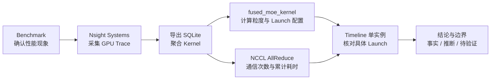
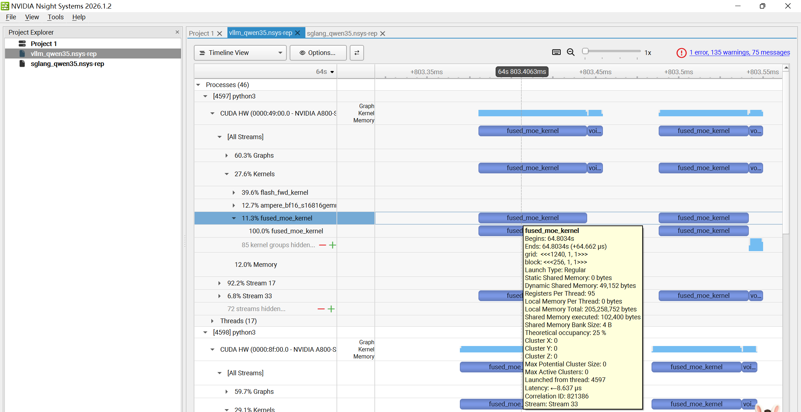
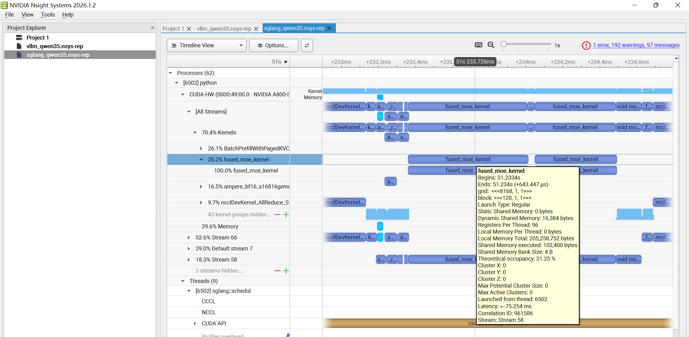

# vLLM vs SGLang：Qwen3.5 MoE 推理性能分析

> 在 2×NVIDIA A800 80GB、TP=2 环境中，从端到端 Benchmark 出发，使用 NVIDIA Nsight Systems、SQLite 与 Timeline 单实例验证，逐层分析 vLLM 和 SGLang 的 MoE 计算与 NCCL 通信差异。

## 项目摘要

本项目不是只给出“哪个框架更快”，而是展示一条可复用的 GPU 性能分析链路：



## 核心结果

### 1. 端到端吞吐

| 场景 | vLLM | SGLang | vLLM 相对提升 |
|---|---:|---:|---:|
| 单并发 | 171.17 tok/s | 143.74 tok/s | 约 19.1% |
| 并发 8 | 704.27 tok/s | 665.66 tok/s | 约 5.8% |

在本次模型、硬件和配置组合中，vLLM 吞吐更高。并发升至 8 后差距缩小，说明单请求与批处理场景不能用同一个数字概括。

### 2. `fused_moe_kernel`

| 框架 | 调用次数 | 累计耗时 | 平均单次耗时 |
|---|---:|---:|---:|
| vLLM | 17,280 | 1,007.93 ms | 58.33 μs |
| SGLang | 3,580 | 1,808.01 ms | 505.03 μs |

SGLang 的平均单次耗时约为 vLLM 的 **8.66×**，但这不等于“整体 MoE 阶段慢 8.66×”：

- 两边的调用次数分别为 3,580 和 17,280，执行粒度不同；
- 本次 trace 中 `fused_moe_kernel` 的累计耗时比为 **1.79×**（1,808.01 / 1,007.93）；

### 3. NCCL AllReduce

| 框架 | 调用次数 | 累计耗时 | 平均单次耗时 |
|---|---:|---:|---:|
| vLLM | 274 | 504.71 ms | 1,841.99 μs |
| SGLang | 3,581 | 858.25 ms | 239.67 μs |

SGLang 的 AllReduce 单次更短，但调用约为 vLLM 的 **13.07×**，trace 内累计 AllReduce 时间约为 **1.70×**。这说明通信组织方式存在明显差异，但仅凭次数与总时长仍不能判断具体是调度、并行策略还是 workload 切分造成的。

## Timeline 单实例验证

| vLLM | SGLang |
|---|---|
|  |  |

| 字段 | vLLM 单实例 | SGLang 单实例 |
|---|---:|---:|
| Duration | 64.662 μs | 643.447 μs |
| Grid | 1240 × 1 × 1 | 8168 × 1 × 1 |
| Block | 256 × 1 × 1 | 128 × 1 × 1 |
| Registers / thread | 95 | 96 |
| Theoretical occupancy | 25% | 31.25% |

单实例耗时相差约 **9.95×**，但 `gridX` 相差约 6.59×，所以它们不是相同 workload 的直接 A/B。SGLang 单实例的理论 occupancy 更高却耗时更长，也说明 occupancy 不能单独用来判断 Kernel 效率。

## Launch 配置观察

vLLM 的 17,280 次 `fused_moe_kernel` 中：

| blockX | 调用次数 | 累计耗时 | 平均耗时 |
|---:|---:|---:|---:|
| 256 | 11,200 | 712.97 ms | 63.66 μs |
| 128 | 6,080 | 294.96 ms | 48.51 μs |

SGLang 的 3,580 次调用均为 `blockX=128`、`registersPerThread=96`。

证明两个框架采用了不同的 Kernel 变体或线程组织。vLLM 的 `blockX=256` 可能是直接影响，但本身还包含多组寄存器配置和不同 `gridX`，而总耗时同时受 workload、访存、占用率、同步与 Kernel 实现影响。

## 实验环境

| 项目 | 配置 |
|---|---|
| GPU | NVIDIA A800-SXM4-80GB ×2 |
| GPU 互联 | NVLink |
| CUDA | 13.0 |
| 模型 | Qwen3.5-35B-A3B MoE |
| 并行方式 | Tensor Parallel，TP=2 |
| Prompt / Output | 512 / 128 tokens |
| Profiler | Nsight Systems 2025.1.1 |

## 关键结论

1. Benchmark 证明本次环境下 vLLM 的吞吐更高，单并发领先约 19.1%，并发 8 领先约 5.8%。
2. Trace 中最值得继续追踪的差异集中在 `fused_moe_kernel` 与 NCCL AllReduce。
3. SGLang 单次 MoE Kernel 更长，但调用次数更少；vLLM 调用更多、单次更短，说明两边的工作切分与执行组织不同。
4. SGLang AllReduce 次数显著更多，trace 内累计通信时间也更高
5. Trace 还暴露了此前未重点学习的 Gated Delta Network（GDN）相关 Kernel，说明模型结构可以从 GPU 执行轨迹反向识别；本项目的核心归因仍聚焦 MoE 与 NCCL。

## 仓库结构

```text
llm-inference-performance-analysis/
├── README.md
├── docs/
│   ├── benchmark.md
│   ├── nsys-analysis.md
│   └── conclusions.md
├── scripts/
│   ├── benchmark_vllm.sh
│   ├── benchmark_sglang.sh
│   ├── profile_vllm.sh
│   ├── profile_sglang.sh
│   └── kernel_analysis.sql
├── results/
│   ├── benchmark_results.md
│   ├── kernel_summary.md
│   └── figures/
│       ├── README.md
│       ├── vllm_fused_moe_timeline.png
│       └── sglang_fused_moe_timeline.png
├── LICENSE
└── .gitignore
```

## 复现实验

脚本要求用户显式提供模型路径和请求数，避免把未知实验参数伪装成原始配置。

```bash
export MODEL_PATH=/path/to/Qwen3.5-35B-A3B
export NUM_PROMPTS=128

# 终端 1：启动并采集服务
bash scripts/profile_vllm.sh

# 终端 2：服务就绪后运行负载
MAX_CONCURRENCY=1 bash scripts/benchmark_vllm.sh
MAX_CONCURRENCY=8 bash scripts/benchmark_vllm.sh
```

SGLang 的使用方式相同，替换为对应脚本即可。完整说明见 [Benchmark](docs/benchmark.md) 与 [Nsight Systems 分析](docs/nsys-analysis.md)。

SQLite 查询：

```bash
nsys export --type sqlite --output vllm_qwen35.sqlite vllm_qwen35.nsys-rep
sqlite3 vllm_qwen35.sqlite < scripts/kernel_analysis.sql
```

## 参考

- [vLLM `bench serve` CLI](https://docs.vllm.ai/en/latest/cli/bench/serve/)
- [SGLang Bench Serving Guide](https://docs.sglang.ai/developer_guide/bench_serving)
- [NVIDIA Nsight Systems Documentation](https://docs.nvidia.com/nsight-systems/)

## License

MIT License，见 [LICENSE](LICENSE)。
