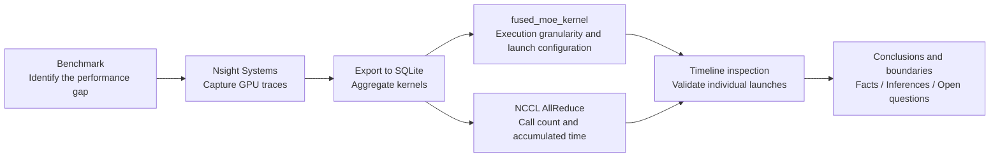

# vLLM vs SGLang: Qwen3.5 MoE Inference Performance Analysis

[中文](README.md) | **English**

> On a 2× NVIDIA A800 80GB setup with TP=2, this project starts from end-to-end benchmarks and progressively analyzes the MoE computation and NCCL communication differences between vLLM and SGLang using NVIDIA Nsight Systems, SQLite, and single-kernel timeline inspection.

## Project Overview

The goal of this project is to demonstrate a reusable GPU performance analysis workflow:



## Key Results

### 1. End-to-End Throughput

| Scenario | vLLM | SGLang | vLLM Improvement |
|---|---:|---:|---:|
| Single concurrency | 171.17 tok/s | 143.74 tok/s | ~19.1% |
| Concurrency 8 | 704.27 tok/s | 665.66 tok/s | ~5.8% |

Under this model, hardware, and configuration combination, vLLM achieved higher throughput. The gap narrowed at concurrency 8, indicating that single-request and batched workloads cannot be summarized by the same number.

### 2. `fused_moe_kernel`

| Framework | Calls | Accumulated Time | Average per Call |
|---|---:|---:|---:|
| vLLM | 17,280 | 1,007.93 ms | 58.33 μs |
| SGLang | 3,580 | 1,808.01 ms | 505.03 μs |

The average duration of an SGLang call was approximately **8.66×** that of vLLM:

- The two frameworks made 3,580 and 17,280 calls respectively, indicating different execution granularities.
- Within these traces, the accumulated `fused_moe_kernel` time ratio was **1.79×** (1,808.01 / 1,007.93).

### 3. NCCL AllReduce

| Framework | Calls | Accumulated Time | Average per Call |
|---|---:|---:|---:|
| vLLM | 274 | 504.71 ms | 1,841.99 μs |
| SGLang | 3,581 | 858.25 ms | 239.67 μs |

SGLang had shorter individual AllReduce calls, but issued approximately **13.07×** as many calls as vLLM. Its accumulated AllReduce time within the trace was approximately **1.70×** higher, indicating a clear difference in communication organization.

## Single-Kernel Timeline Validation

| vLLM | SGLang |
|---|---|
|  |  |

| Field | vLLM Instance | SGLang Instance |
|---|---:|---:|
| Duration | 64.662 μs | 643.447 μs |
| Grid | 1240 × 1 × 1 | 8168 × 1 × 1 |
| Block | 256 × 1 × 1 | 128 × 1 × 1 |
| Registers / thread | 95 | 96 |
| Theoretical occupancy | 25% | 31.25% |

The selected instances differed in duration by approximately **9.95×**, but their `gridX` values differed by approximately 6.59×, so they are not a direct A/B comparison of identical workloads. The SGLang instance also had higher theoretical occupancy despite its longer duration, showing that occupancy alone is insufficient for judging kernel efficiency.

## Launch Configuration Observations

Among vLLM's 17,280 `fused_moe_kernel` calls:

| blockX | Calls | Accumulated Time | Average Duration |
|---:|---:|---:|---:|
| 256 | 11,200 | 712.97 ms | 63.66 μs |
| 128 | 6,080 | 294.96 ms | 48.51 μs |

All 3,580 SGLang calls used `blockX=128` and `registersPerThread=96`.

This demonstrates that the two frameworks used different kernel variants or thread organizations. vLLM's use of `blockX=256` may have a direct effect, but those launches also contained multiple register configurations and different `gridX` values. Total execution time is additionally influenced by workload, memory access, occupancy, synchronization, and kernel implementation.

## Experimental Environment

| Item | Configuration |
|---|---|
| GPU | NVIDIA A800-SXM4-80GB ×2 |
| GPU Interconnect | NVLink |
| CUDA | 13.0 |
| Model | Qwen3.5-35B-A3B MoE |
| Parallelism | Tensor Parallel, TP=2 |
| Prompt / Output | 512 / 128 tokens |
| Profiler | Nsight Systems 2025.1.1 |

## Key Conclusions

1. The benchmarks show that vLLM achieved higher throughput in this environment, leading SGLang by approximately 19.1% at single concurrency and 5.8% at concurrency 8.
2. The most significant trace-level differences to investigate further are concentrated in `fused_moe_kernel` and NCCL AllReduce.
3. SGLang used longer but fewer MoE kernel calls, whereas vLLM issued more calls with shorter individual durations, indicating different workload partitioning and execution organization.
4. SGLang issued substantially more AllReduce calls and accumulated more communication time within the trace.
5. The traces also exposed Gated Delta Network (GDN) related kernels that had not been a primary focus of the earlier model-architecture study, demonstrating that model structure can be identified from GPU execution traces.

## Repository Structure

```text
llm-inference-performance-analysis/
├── README.md
├── README_EN.md
├── docs/
│   ├── benchmark.md
│   ├── nsys-analysis.md
│   └── conclusions.md
├── scripts/
│   ├── benchmark_vllm.sh
│   ├── benchmark_sglang.sh
│   ├── profile_vllm.sh
│   ├── profile_sglang.sh
│   └── kernel_analysis.sql
├── results/
│   ├── benchmark_results.md
│   ├── kernel_summary.md
│   └── figures/
│       ├── README.md
│       ├── vllm_fused_moe_timeline.png
│       └── sglang_fused_moe_timeline.png
├── LICENSE
└── .gitignore
```

## Reproducing the Experiment

The scripts require the model path and request count to be supplied explicitly, avoiding the presentation of unknown experimental parameters as if they were part of the original setup.

```bash
export MODEL_PATH=/path/to/Qwen3.5-35B-A3B
export NUM_PROMPTS=128

# Terminal 1: start the server under Nsight Systems
bash scripts/profile_vllm.sh

# Terminal 2: run the workload after the server is ready
MAX_CONCURRENCY=1 bash scripts/benchmark_vllm.sh
MAX_CONCURRENCY=8 bash scripts/benchmark_vllm.sh
```

SGLang follows the same workflow using the corresponding scripts. See [Benchmark Methodology](docs/benchmark.md) and [Nsight Systems Analysis](docs/nsys-analysis.md) for details.

SQLite analysis:

```bash
nsys export --type sqlite --output vllm_qwen35.sqlite vllm_qwen35.nsys-rep
sqlite3 vllm_qwen35.sqlite < scripts/kernel_analysis.sql
```

## References

- [vLLM `bench serve` CLI](https://docs.vllm.ai/en/latest/cli/bench/serve/)
- [SGLang Bench Serving Guide](https://docs.sglang.ai/developer_guide/bench_serving)
- [NVIDIA Nsight Systems Documentation](https://docs.nvidia.com/nsight-systems/)

## License

MIT License. See [LICENSE](LICENSE).
